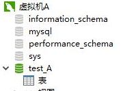

首先建立两个mysql环境。该文章中数据库环境为Centos7, mysql5.7.28，均为虚拟机，在主机上使用Navicat通过局域网连接两个数据库进行测试。

由于复制功能基于二进制日志，所以在开启复制之前，应保证两个数据库中都有相同的库结构及数据，否则容易引起复制语句异常。Mysql的版本最好保持一致避免可能的异常。

## 基本的条件：

- 主从数据库连接正常，能正常Ping通。
- 端口正确开放
- 防火墙等的配置（避免在读取二进制日志时出现问题）




## 修改数据库配置文件 /etc/my.cnf

在**数据库A**的[mysqld]部分添加或修改以下内容：

```
server_id=1 //数据库A 的唯一标识，必须唯一
log-bin=master_01 //开启二进制日志，数据库同步的基础
binlog-do-db=test_A // 需要同步的库，两边的库名字要一样并且一行只能写一个库
```

在**数据库B**的[mysqld]部分添加或修改以下内容：

```
server_id=2
log-bin=master_02
binlog-do-db=test_A
```

若需要同步多个库需要将binlog-do-db分为多行写，如下

```
binlog-do-db=test_A
binlog-do-db=test_B
binlog-do-db=test_C
```

要注意 “binlog-do-db=test_A, test_B, test_C” 这种写法是**错误**的，会将ABC认为是同一个库, 并且在后续操作中不会出现异常报错

修改完成后**重启数据库**使修改生效

```
systemctl restart mysqld.service
```

## 配置主从复制功能

进入mysql控制台，查看当前**数据库A**的状态，并且记录File和Position值

```
show master status;
```


如图，记录的File值为master_01.000001，Position值为2653

*注意，在运行show master status命令前，应保证该数据库无任何****写操作\****，应停止服务或者加入 FLUSH TABLES WITH READ LOCK 锁。同时可在此时对数据库进行备份，并且将数据保存到另一个数据库中（表结构及数据等）以保证数据一致性并且防止后续操作出现异常。*

记录好值以后可以开放数据库A

```
UNLOCK TABLES;
```

来到**数据库B** 中，关闭复制功能

```
stop slave;
```

配置复制功能，修改下列代码中为对应的值，并执行

```
CHANGE MASTER TO
MASTER_HOST='数据库A的ip地址',
MASTER_USER='数据库A提供的用于复制的用户',
MASTER_PASSWORD='密码',
MASTER_PORT=3306,
MASTER_LOG_FILE='刚记录的数据库A的File文件名',
MASTER_LOG_POS=刚记录的数据库A的Position值,
MASTER_CONNECT_RETRY=数据库A的server_id;
```

开启复制功能

start slave;

同样的，对数据库B也是同样的操作，
记录**数据库B** 的状态值

```
show master status; 
```

然后在**数据库A** 中

```
stop slave; 
```

执行代码（将上文代码中数据库A的值换为数据库B的）

```
CHANGE MASTER TO
MASTER_HOST='数据库B的ip地址',
MASTER_USER='数据库B提供的用于复制的用户',
MASTER_PASSWORD='密码',
MASTER_PORT=3306,
MASTER_LOG_FILE='刚记录的数据库B的File文件名',
MASTER_LOG_POS=刚记录的数据库B的Position值,
MASTER_CONNECT_RETRY=数据库B的server_id;
```

开启复制功能

```
start slave;
```

配置完两个数据库后执行

```
show slave status\G;
```

查看配置情况，若无发现Error报错信息，则正常启动，可以通过Navicat等可视化软件对配置的库进行测试。若一切正常，在AB数据库中的操作均可正常复制到另一个数据库中。

## 可能的问题

same uuid：我在配置过程中发现这个问题，原因是因为在配置虚拟机环境时是配置好一个虚拟机的mysql环境后直接使用VMware的克隆功能，导致两个数据库的uuid相同。解决方法：删除任意一个数据库的auto.conf文件（在my.cnf文件中datadir对应的路径下，一般是/var/lib/mysql/ ）删除后重启该数据库，会重新生成该文件。

Slave_IO_Running: NO ：表示在拉取二进制日志时出现异常，通常是由防火墙导致

Slave_IO_Running: Connecting ：连接错误或者配置错误，检查数据库ip地址及端口，检查配置的ip地址是否错误，防火墙拦截等。

## 参考资料：

https://blog.51cto.com/13577495/2167525

https://www.mysqlzh.com/doc/55.html