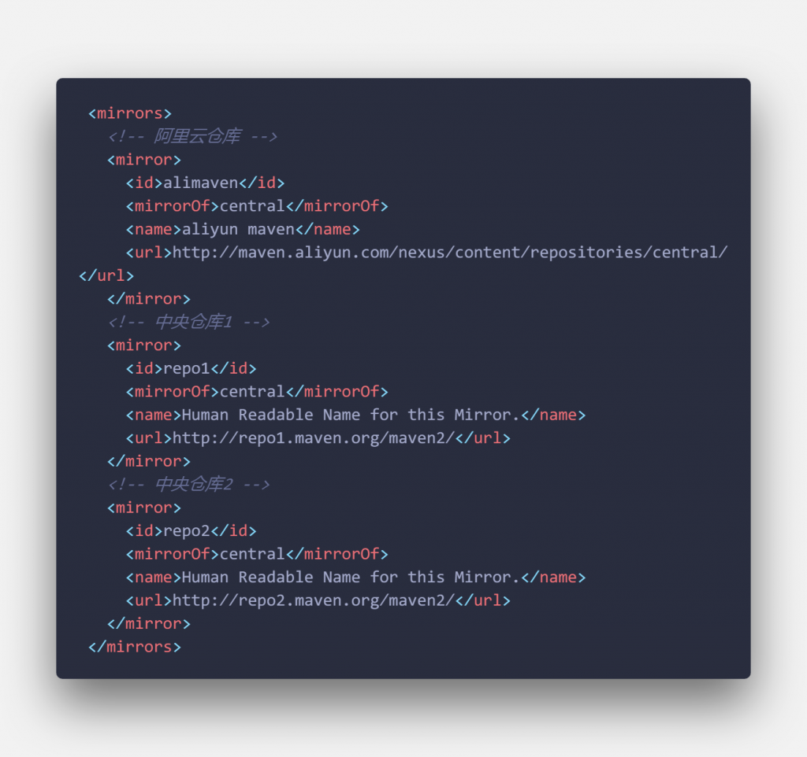
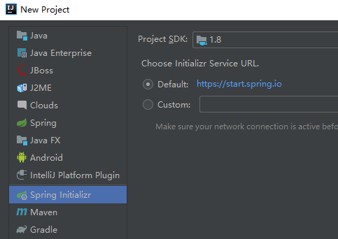
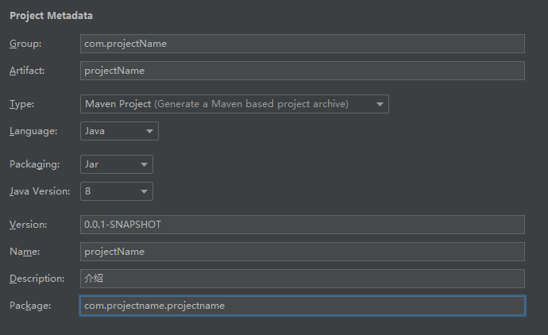
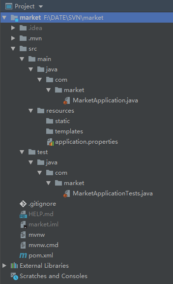

### 一、简介 

> Spring Boot 是由 Pivotal 团队提供的全新框架，其设计目的是用来简化新 Spring 应用的初始搭建以及开发过程。该框架使用了特定的方式来进行配置，从而使开发人员不再需要定义样板化的配置。通过这种方式，Spring Boot 致力于在蓬勃发展的快速应用开发领域 (rapid application development) 成为领导者。
> 从最根本上来讲，Spring Boot 就是一些库的集合，它能够被任意项目的构建系统所使用。
>
> 百度百科

### 二、环境准备

本文以SpringBoot+Maven+Mybatis+MySQL为例，IDE使用IDEA。

IDEA版本注意为[Ultimate](https://www.jetbrains.com/idea/download/#section=windows) (Ultimate与Community版相比，集成了更多面向于WEB相关的工具)
JAVA版本为1.8
MySQL版本为5.7.25
Maven使用IDEA自带:
配置阿里镜像源:打开IDEA，File->settings


Build->Build Tools->Maven 中User settings file可以查看当前maven的配置项，打开路径对应文件。



找到xml文件中mirrors标签，添加以下代码

```
<!-- 阿里云仓库 -->
<mirror>
	<id>alimaven</id>
	<mirrorOf>central</mirrorOf>
	<name>aliyun maven</name>
	<url>http://maven.aliyun.com/nexus/content/repositories/central/</url>
</mirror>
```

以上操作配置Maven镜像源为阿里国内源，加快速度。

### 三、创建项目

IDEA -> File -> new project -> Spring Initializr





接下来选择项目依赖，具体依赖根据项目需求选择，后期也可以在pom.xml中修改



main中为项目源代码，MarketApplication.java为项目启动入口；
resources为静态资源目录，application.properties为项目的配置文件，配置文件还有 application.yml 的yml类型。
test中为项目测试代码，该部分主要为项目测试代码。
pom.xml文件为Maven项目的依赖配置文件。

### 四、添加相关依赖

打开pom.xml文件，
下方找到dependencies段，添加mybatis与mysql依赖

```
<!--mybatis-->
<dependency>
    <groupId>org.mybatis.spring.boot</groupId>
    <artifactId>mybatis-spring-boot-starter</artifactId>
    <version>2.0.0</version>
</dependency>

<!--mysql-->
<dependency>
    <groupId>mysql</groupId>
    <artifactId>mysql-connector-java</artifactId>
    <version>5.1.39</version>
</dependency>
```

至此完成SpringBoot Web项目集成Mybatis的配置。