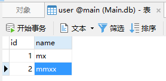
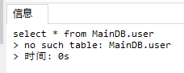

sqlite是基于文件的数据库，正常使用sql语句操作一般都是同一个数据库，即同一个文件。若要同时操作多个sqlite数据库呢，这时候就可以用Attach和Detach语法。

Attach 附加数据库，将一个数据库文件附加到当前连接上。

Detach 分离数据库，跟Attach相反，即分离附加的数据库。

假设现在有两个数据库文件，”Main.db”和”Main_Bak.db”。

Main数据库中有一个user表如下：



Main_Bak数据库为空，没有任何表和数据。

现在仅连接Main_Bak数据库。

```sqlite
attach database 'Main.db' as MainDB; # 路径应为绝对路径，此处略去了
```

表示将Main.db这个数据库文件附加到当前连接的数据库上，也就是现在可以同时操作两个数据库，Main中的表即可以通过”MainDB.表名”的形式索引到。

测试一下

```sqlite
select * from MainDB.user; # 在Main_Bak数据库中查询Main数据库的信息
```


结果正确

```sqlite
create table user_bak as select * from MainDB.user; # 以Main数据库中user表的结构和数据在Main_bak数据库中建表
```


操作成功，同时操作了两个数据库文件。

最后分离已附加上的数据库

detach database MainDB;

若此时再次执行上文中的查询语句便会报错



参考资料:

https://www.sqlite.org/lang_attach.html

https://www.runoob.com/sqlite/sqlite-attach-database.html