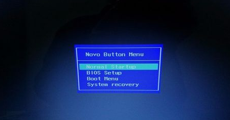
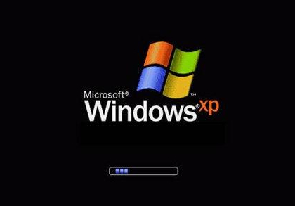

boot是bootstrap的简写形式，当然这里的bootstrap不是指[web框架](https://getbootstrap.com/)的bootstrap，而是指计算机的“引导”。

bootstrap原意是靴子，但是这跟计算机有什么关系呢？

这源于一句谚语：

> pull oneself up by one’s bootstraps
>
> 拽着鞋带把自己拉起来

这个句子很有意思，就像左脚踩右脚不断交替就能上天一样。

工程师把这个用来比喻计算机启动的过程，原因是因为：计算机上的大多数程序是由其他程序加载到计算机上的，那就意味着需要有一个机制将初始程序加载到计算机上。换句话说就是，计算机需要启动才能运行程序，而运行程序则需要启动计算机，而这明显是不能实现的。

*解释清楚死锁，我们就雇你；雇我我就解释给你听；来吧，我们讨论一下薪水的事情吧！*

早期的工程师使用各种方法把程序放入内存中以临时解决该问题，直到后来**Rom**的出现彻底解决了这个问题。

> Read-only memory (ROM) is a type of non-volatile memory used in computers and other electronic devices. Data stored in ROM cannot be electronically modified after the manufacture of the memory device. 
>
> 
> 摘自[wiki](https://en.wikipedia.org/wiki/Read-only_memory)

翻译：只读存储器是一种在计算机和其他电子设备中使用的非易失性存储设备。存储在Rom中的数据一经制造就无法以电子方式修改。

当然，随着科技的发展，Rom已经发展出了许多种类：可编程只读存储器（PROM）、可擦可编程序只读存储器（EPROM）和电可擦可编程只读存储器ROMROM（EEPROM），Rom已经不再是出厂就无法修改，从而也衍生出刷BIOS、刷Rom等操作了。

而现在，这个Rom就存在计算机的主板上，里面写入的程序呢，就是**BIOS**。

**BIOS ( Basic Input Output System )** ，是计算机启动后运行的第一个程序。这个程序的功能就是最基本的输入输出、计算机自检和系统自启功能。

计算机启动后，运行BIOS，首先进行自检，检查计算机上的硬件（CPU、内存等）是否满足运行的条件，若没有问题则转入下一阶段，否则报警并中止。

自检没有问题，那么下一步就是决定启动顺序。

经常装系统的同学可能很熟悉这个操作：插上U盘，按下开机键（短接电源），猛按f8或者某个按键，在屏幕弹出来的窗口上选择U盘，然后就进入PE或者是系统安装程序进行系统的安装。

BIOS启动后，需要运行下一个程序，也就是要找到下一个启动程序所在的存储设备（例如硬盘或者U盘）。

BIOS根据用户选择的启动设备或者是默认的启动顺序，判断该设备是否可用于引导（判断设备的第一个扇区，最前面的512字节的最后两个字节是否是0x55和0xAA，这512个字节就叫MBR 主引导记录）

现在知道设备可用于启动了，那么现在就需要知道该到哪去运行下一个程序。而MBR中存储的就是操作系统在该设备上的位置，下一步就显而易见了，找到操作系统，启动！

文章篇幅看似挺长，对于今天的计算机来讲，不过是“弹指一瞬间”，按下开机按钮，不出一会屏幕上就显示出操作系统的启动动画，或者对于土豪玩家，说不定已经能看到桌面了（汗。

当然，上文中描述的启动顺序也并不完整，其中省略了一些关于分区表的部分，并且文章中说的MBR+BIOS的引导启动已经是过去式了，现在的引导方式也都变成了GPT+UEFI的形式。

MBR和GPT其实都是分区表的两种种类，MBR是512字节，一个主分区的扇区总数不超过2^32即逻辑地址有32位，而每个扇区大小512字节，2^32\*512即2T，所以MBR支持的最大容量为2T；而GPT逻辑地址提升至64位，则理论最大分区大小为2^64-1\*512即18eb（1eb=1024pb=1024^2tb）。

UEFI和BIOS的话，可以说UEFI相当于BIOS的升级版，兼容性、容错性、纠错性等更好，具体参见[Wiki](https://en.wikipedia.org/wiki/Unified_Extensible_Firmware_Interface)。

总的来说，系统启动的过程就像多米诺骨牌一样，由小到大，从一开始的BIOS逐步启动到操作系统。